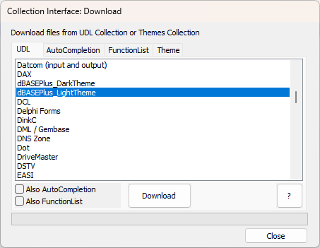
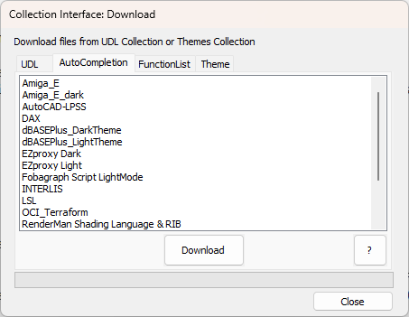
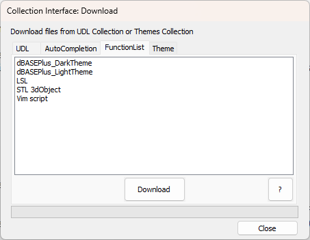
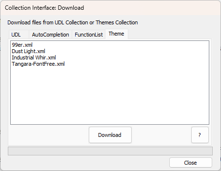

# CollectionInterface

A Notepad++ Plugin that allows easy interface to the online Collections for user-submitted UDL and Themes:
- [User Defined Language Collection](https://github.com/notepad-plus-plus/userDefinedLanguages)
- [Themes Collection](https://github.com/notepad-plus-plus/nppThemes)

This plugin allows you to easily download and install a UDL or Theme, which will be available after you restart Notepad++.

AutoCompletion and FunctionList definitions are associated with a specific UDL, so they can be downloaded along with the UDL (or separately).  The Themes are completely separate (from a different Collection), but this interface will work for accessing both.

## Menu

The **Plugins > CollectionInterface** menu has the following actions

- **Collection Interface: Download**: This is the main interface for the plugin.
- **Help: Download**: This provides help for downloading files.  The **?** button in the main dialog will also access this information.
- **About**: Gives info about the plugin.

## Collection Interface: Download

### UDL tab

You can scroll through the available UDLs, and click on one to select it.

If there is an AutoCompletion file or FunctionList file in the repo as well, you can mark those checkboxes if you want to simultaneously download the associated files.  If a UDL doesn't have the associated file, the checkbox will be disabled (grayed out).

The **Download** button will download and install the UDL definition file (and the associated AutoCompletion and/or FunctionList, if chosen).

The progress bar near the bottom will be at 100% when the Download is complete.  Once you pick a different UDL, the progress bar resets to 0%.

### AutoCompletion tab

You can scroll through the available AutoCompletion definitions, and click on one to select it. (Not all UDLs have an associated AutoCompletion in the repository, so this tab only shows those that are available.)

There are no buttons for downloading the "associated" files; if you want to download the UDL and AutoCompletion and FunctionList at the same time, use the UDL tab.

The **Download** button will download and install the AutoCompletion definition file.

The progress bar near the bottom will be at 100% when the Download is complete.  Once you pick a different UDL, the progress bar resets to 0%.

### FunctionList tab

You can scroll through the available FunctionList definitions, and click on one to select it. (Not all UDLs have an associated FunctionList in the repository, so this tab only shows those that are available.)

There are no buttons for downloading the "associated" files; if you want to download the UDL and AutoCompletion and FunctionList at the same time, use the UDL tab.

The **Download** button will download and install the FunctionList definition file.

The progress bar near the bottom will be at 100% when the Download is complete.  Once you pick a different UDL, the progress bar resets to 0%.

### Theme tab

You can scroll through the available Theme files, and click on one to select it. (Themes are completely separate from UDLs, so there is no linkage.)

The **Download** button will download and install the Theme file.

The progress bar near the bottom will be at 100% when the Download is complete.  Once you pick a different UDL, the progress bar resets to 0%.

### Directory Permissions

Depending on your Windows setup and the directory permissions, and whether you are running Notepad++ normally or "As Administrator", you might not have permission to write downloaded files to specific directories. If that's the case, then for each file that it doesn't have permission, a dialog will inform you that it needs the permission; if you don't CANCEL at this point, Windows will pop up it's UAC Elevation, asking if you want "this app to make changes to your device", and you should give it permission (possibly requiring your Windows credentials) -- it's a Windows operating system interface, and this plugin will never see your password or anything else from the Windows UAC prompt.

### Restart after Download

You must exit Notepad++ completely and restart the application in order for the new UDL/AutoCompletion/FunctionList/Theme downloads to take effect and be available in Notepad++.

**TODO**: If you **Download** any files, then when you **Close** the dialog, you will be asked whether you want to have the Plugin restart Notepad++ for you.
